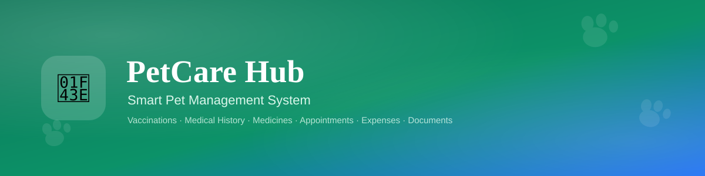
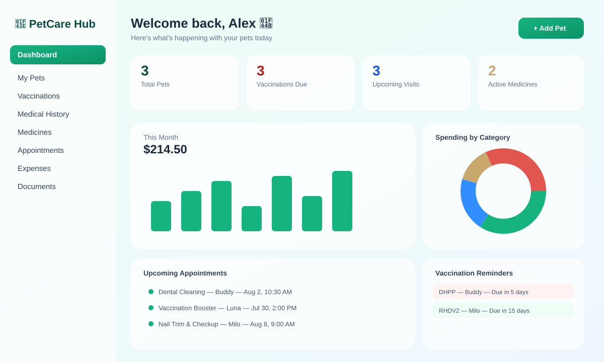
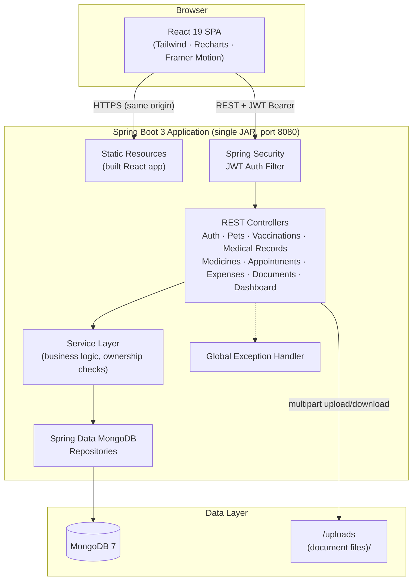

<div align="center">



# 🐾 PetCare Hub — Smart Pet Management System

**A premium, full-stack SaaS platform for tracking every pet's health, care and expenses in one place.**

[](https://openjdk.org/)
[](https://spring.io/projects/spring-boot)
[](https://www.mongodb.com/)
[](https://react.dev/)
[](https://vitejs.dev/)
[](https://tailwindcss.com/)
[](LICENSE)

[Features](#-features) · [Screenshots](#-screenshots) · [Tech Stack](#-tech-stack) · [Architecture](#-architecture) · [Getting Started](#-getting-started) · [API Overview](#-api-overview) · [Folder Structure](#-folder-structure)

</div>

---

## 📖 About

**PetCare Hub** is a complete pet management platform built for pet parents who juggle vaccination schedules, vet visits, medicines, and expenses across multiple pets. It ships as a single Spring Boot application that serves both the REST API and a polished React SaaS dashboard — one command, one port, everything running.

A demo account with realistic sample data (3 pets, vaccination history, medical records, medicines, appointments and 6 months of expenses) is **seeded automatically** on first startup, so you can explore — or demo it to anyone — immediately without manual setup.

> 🔑 **Demo login:** `demo@petcarehub.dev` / `Demo@1234`

---

## ✨ Features

| Category | Capabilities |
|---|---|
| 🔐 **Authentication** | JWT-based register/login, secure password hashing (BCrypt), protected routes |
| 🐕 **Pet Profiles** | Multi-pet support, species/breed/gender/weight/microchip tracking, photo, notes |
| 💉 **Vaccinations** | Full history, next-due tracking, automatic overdue/due-soon detection, reminders |
| 🩺 **Medical History** | Visit records, diagnoses, treatments, vet & clinic details |
| 💊 **Medicine Tracking** | Dosage, frequency, active/completed status, prescribing vet |
| 📅 **Appointments** | Scheduling, status workflow (scheduled → completed/cancelled), visual timeline |
| 💰 **Expense Management** | Category-tagged expenses, monthly trend & category breakdown analytics |
| 📄 **Documents** | Upload & store vaccination certificates, insurance papers, medical files |
| 📊 **Dashboard Analytics** | Live stats, Recharts-powered pie/bar charts, upcoming reminders at a glance |
| 🎨 **Premium UI/UX** | Glassmorphism cards, Framer Motion animations, responsive layouts, skeleton loaders, toast notifications, search/filter/pagination everywhere |
| 📚 **API Docs** | Full Swagger/OpenAPI UI at `/swagger-ui.html` |
| 🚀 **Single-Run Deploy** | Frontend is built and embedded into the Spring Boot JAR automatically — one process serves everything |

---

## 📸 Screenshots

<div align="center">

<p><em>Dashboard — live stats, expense analytics, appointment timeline and reminders</em></p>
</div>

> The graphic above is a design preview generated alongside this codebase. See [`screenshots/README.md`](screenshots/README.md) for guidance on swapping in real screen captures once you have the app running locally.

---

## 🧱 Tech Stack

**Backend**
- Java 21 · Spring Boot 3.3
- Spring Data MongoDB
- Spring Security + JWT (jjwt)
- Bean Validation (Jakarta Validation)
- springdoc-openapi (Swagger UI)
- Global exception handling
- Plain Controller → Service → Repository architecture — **no Lombok, no DTOs, no mappers**; entities are used directly with constructor injection throughout

**Frontend**
- React 19 · Vite 6
- Tailwind CSS 3 (custom glassmorphism theme)
- React Router 6
- Axios (JWT interceptor)
- React Hook Form
- Recharts (pie & bar analytics)
- Framer Motion (page/element animations)
- Lucide Icons

**Infrastructure**
- MongoDB 7
- Docker & Docker Compose
- Maven (`frontend-maven-plugin` builds the React app and embeds it into the Spring Boot JAR)

---

## 🏗 Architecture



**Request flow:** Controller → Service → Repository, with all business rules (ownership verification, cascading deletes, validation) living in the service layer. Controllers stay thin and only handle HTTP concerns; entities flow straight through since no DTO/mapper layer is used, per this project's design constraints.

---

## 🚀 Getting Started

### Option 1 — Docker Compose (recommended, single command)

```bash
docker compose up --build
```

This builds the React frontend, embeds it into the Spring Boot JAR, starts MongoDB, and runs everything on:

👉 **http://localhost:8080**

Log in with the seeded demo account (`demo@petcarehub.dev` / `Demo@1234`) or register your own.

### Option 2 — Run locally without Docker

**Prerequisites:** Java 21, Maven 3.9+, Node.js 20+, a running MongoDB instance (local or Atlas).

```bash
# 1. Start MongoDB (if not already running)
mongod --dbpath /path/to/data

# 2. Build & run — this also builds the React frontend and embeds it automatically
cd backend
mvn clean package
java -jar target/petcare-hub.jar
```

Then open **http://localhost:8080** — the API and the UI are served from the same process.

### Option 3 — Frontend dev mode (hot reload, for active development)

```bash
# Terminal 1 — backend API only
cd backend
mvn spring-boot:run

# Terminal 2 — frontend with instant hot-reload
cd frontend
npm install
npm run dev
```

Vite runs on **http://localhost:5173** and proxies `/api` and `/uploads` requests to the backend on port 8080 (see `frontend/vite.config.js`).

### Environment Variables

| Variable | Default | Description |
|---|---|---|
| `MONGODB_URI` | `mongodb://localhost:27017/petcare_hub` | MongoDB connection string |
| `JWT_SECRET` | *(dev key included)* | Signing key for JWTs — **change this in production** |
| `JWT_EXPIRATION_MS` | `86400000` (24h) | Token lifetime in milliseconds |
| `UPLOAD_DIR` | `uploads` | Directory where uploaded documents are stored |
| `CORS_ALLOWED_ORIGINS` | `http://localhost:5173` | Comma-separated allowed origins |
| `SERVER_PORT` | `8080` | Server port |

---

## 📚 API Overview

Interactive documentation is available once the app is running:

- **Swagger UI:** http://localhost:8080/swagger-ui.html
- **OpenAPI JSON:** http://localhost:8080/v3/api-docs
- **Postman Collection:** [`postman_collection.json`](postman_collection.json) — import it, run **Auth → Login** first, and the `{{token}}` variable auto-populates for every other request.

| Group | Base Path | Description |
|---|---|---|
| Auth | `/api/auth` | Register, login, current profile |
| Pets | `/api/pets` | Pet profile CRUD |
| Vaccinations | `/api/pets/{petId}/vaccinations`, `/api/vaccinations` | Records + due-soon reminders |
| Medical Records | `/api/pets/{petId}/medical-records`, `/api/medical-records` | Visit history |
| Medicines | `/api/pets/{petId}/medicines`, `/api/medicines` | Prescriptions & active tracking |
| Appointments | `/api/pets/{petId}/appointments`, `/api/appointments` | Scheduling & status workflow |
| Expenses | `/api/pets/{petId}/expenses`, `/api/expenses` | Costs, category breakdown, monthly trend |
| Documents | `/api/pets/{petId}/documents`, `/api/documents` | File upload/list/delete |
| Dashboard | `/api/dashboard/summary` | Aggregated analytics for the home page |

All `/api/**` routes (except `/api/auth/**`) require a `Authorization: Bearer <token>` header.

---

## 📁 Folder Structure

```
petcare-hub/
├── backend/                          # Spring Boot 3 / Java 21 API
│   ├── src/main/java/com/petcare/hub/
│   │   ├── config/                   # Security, OpenAPI, WebMvc, demo data seeder
│   │   ├── controller/               # REST controllers (thin, HTTP-only)
│   │   ├── service/                  # Business logic, ownership checks
│   │   ├── repository/               # Spring Data MongoDB repositories
│   │   ├── model/                    # MongoDB documents (entities), Bean Validation
│   │   ├── security/                 # JWT util, filter, user details service
│   │   └── exception/                # Global exception handler + custom exceptions
│   ├── src/main/resources/
│   │   ├── application.yml
│   │   └── static/                   # React production build lands here at build time
│   └── pom.xml
├── frontend/                         # React 19 / Vite SPA
│   └── src/
│       ├── api/                      # Axios instance + endpoint modules
│       ├── components/               # layout, ui, pets, vaccinations, medicines, …
│       ├── context/                  # AuthContext, ToastContext
│       ├── hooks/                    # useListControls (search/filter/pagination)
│       ├── pages/                    # One page component per route
│       └── utils/                    # Formatters (dates, currency, age, colors)
├── screenshots/                      # Banner + UI preview graphics
├── docker-compose.yml                # MongoDB + single-run app container
├── Dockerfile                        # Multi-stage build (frontend + backend → one JAR)
├── postman_collection.json           # Full API collection with auto-auth
├── LICENSE
└── README.md
```

---

## 🔒 Design Notes

- **No Lombok** — all entities use explicit constructors, getters and setters.
- **No DTOs / Mappers** — controllers and services operate directly on entities; request/response shaping (e.g. auth tokens) uses plain `Map<String, Object>` instead of a dedicated DTO layer.
- **Constructor injection only** — every controller, service and security component wires its dependencies through the constructor; no field injection anywhere.
- **Ownership enforcement** — every resource (vaccination, medicine, appointment, etc.) is checked against the authenticated user's id in the service layer before being returned or modified.

---

## 🤝 Contributing

Issues and pull requests are welcome. Please open an issue first to discuss significant changes.

## 📄 License

Released under the [MIT License](LICENSE).

<div align="center">
<sub>Built with 🐾 for pet parents everywhere.</sub>
</div>
